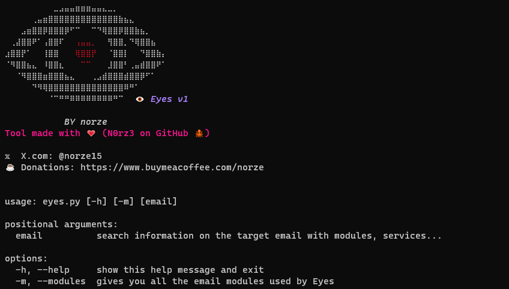
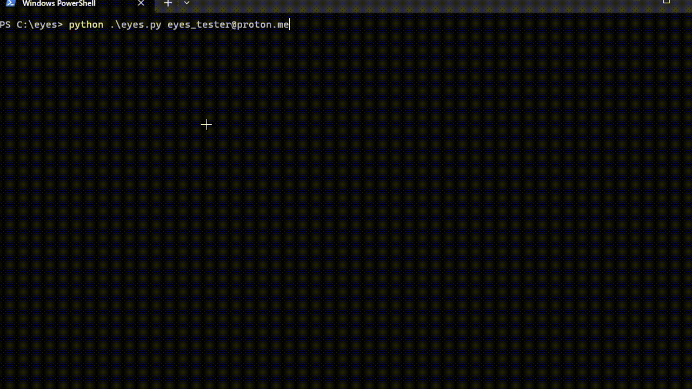

<h1 align="center" id="title">👁️🌍 E y e s</h1><br>


# **🕵️ Eyes is an OSINT tool to get existing accounts from an email**



## 😇 About

> Eyes is osint tool based on account search from an email address

> Eyes is able to find not only if an account is existing on different sites but also to find the account in question (with certain modules)

> even if the profile has nothing to do with the email 😲!

**All this without warning the target 🕵️‍♂️**

**Features of script :**

- fully async
- asynchrone scraping
- menu in cli format (commands)

**🗃️ Modules**
Name | Key |
| ------------------- |-------------- |
| [Bitmoji](https://www.bitmoji.com/) | ❌ 🔑 |
| [Duolingo](https://www.duolingo.com/) | ❌ 🔑 |
| [GitHub](https://github.com) | 🤔🔑 (you can add one for better results) |  
| [Gravatar](https://en.gravatar.com/) | ❌ 🔑 |
| [Imgur](https://imgur.com) | ❌ 🔑 |
| [Mail.ru](https://mail.ru/) | ❌ 🔑 |
| [Pastebin](https://pastebin.com) | ❌ 🔑 |
| [Protonmail](https://proton.me/mail) | ❌ 🔑 |
| [X (Twitter)](https://x.com) | ❌ 🔑 |
| [Instagram](https://instagram.com) | ❌ 🔑 |

### 📸🙋‍♂️ Facial recognition

Eyes also use facial recognition in the GitHub module to study the profile picture (if available).
The facial recognition module is called: Venom

**You will have the explanations of its operation in the file of [venom](lib/venom.py)**

## 🛠️ Requirements / Launch

- [Python 3](https://www.python.org/downloads/)
- [Git](https://git-scm.com/downloads)
- [New terminal](https://apps.microsoft.com/store/detail/windows-terminal/9N0DX20HK701?hl=en-us&gl=us) (to display emojis) # only for windows

```
$ git clone https://github.com/N0rz3/Eyes.git
$ cd ./Eyes
$ pip3 install -r requirements.txt
```

Eyes is very easy to use and not at all complex 🤙

### 🏄 Usage

```
usage: python eyes.py [-h] [-m] [email]

positional arguments:
  email          search information on the target email with modules, services...

options:
  -h, --help     show this help message and exit
  -m, --modules  gives you all the email modules used by Eyes
```

### 🎥 Demo



## 🌞 More

If you want to discover other tools of the same kind there are :

- [Osint Industries](https://osint.industries/)
- [Holehe](https://github.com/megadose/holehe)
- [Buster](https://github.com/sham00n/buster)
  And others...

### ✔️ / ❌ Rules

This tool was designed for educational purposes only and is not intended for any mischievous use, I am not responsible for its use.
